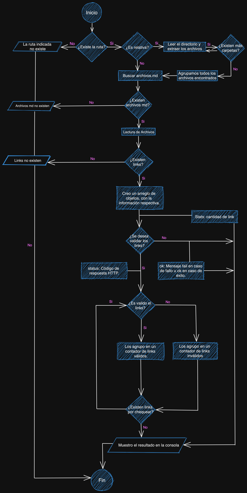

# MD-Link

## Índice

* [1. Descripción](#1-descripción)
* [2. Diagrama de flujo](#2-diagrama-de-flujo)
* [3. Instrucciones](#2-instrucciones)
* [4. Ejemplos de uso](#4-ejemplos-de-uso)


***

## 1. Descripción

Librería creada en NodeJS para encontrar URLs de archivos Markdown,
que indica la cantidad de links encontrados, y diferentes opciones
tales como el status, si esta "ok/fail", y si el usuario lo desea
validar las URLs es decir puede entregar distintas estadísticas según
las opciones utilizadas.

## 2. Diagrama de flujo

A continuación se muestra el diagrama de flujo utilizado para desarrollar el proyecto:



## 3. Instrucciones
### 3.1 Instalación:

```shell
npm --global install https://github.com/rossyalex/md-links
```

### 3.2 Utilización:

Es una librería que nos permite conseguir todas las URLs de algún directorio o
archivo mediante el comando:

```shell
mdLinks --path /Users/nombre-usuario/project --options validate stats
```
Alternativa con alias:

```shell
mdLinks -p /Users/nombre-usuario/project -o validate stats
```

Para su uso mediante instalación:

```javascript
const { lectorMd } = require("rossyalex/md-links");
lectorMd(path, options);
```

## 4. Ejemplos de uso

